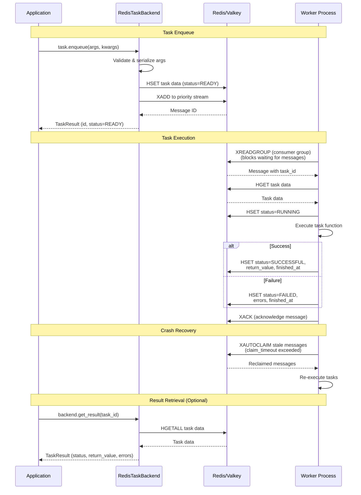

# django-tasks-redis

[](https://github.com/tokibito/django-tasks-redis/actions/workflows/ci.yml)
[](https://badge.fury.io/py/django-tasks-redis)
[](https://pypi.org/project/django-tasks-redis/)
[](https://opensource.org/licenses/MIT)

A Redis/Valkey-backed task queue backend for Django 6.0's built-in task framework.

## Features

- Full integration with Django 6.0's task framework (`django.tasks`)
- Redis Streams for reliable task queuing with consumer groups
- Support for both Redis and Valkey backends
- Delayed task execution with scheduled times
- Priority-based task processing
- Crash recovery with automatic task reclaim
- Django Admin integration for task monitoring and management
- HTTP endpoints for external triggers (webhooks, Cloud Scheduler, etc.)

## Architecture



## Requirements

- Python 3.12+
- Django 6.0+
- Redis 5.0+ or Valkey 7.2+

## Installation

```bash
pip install django-tasks-redis
```

## Quick Start

1. Add `django_tasks_redis` to your `INSTALLED_APPS`:

```python
INSTALLED_APPS = [
    # ...
    "django_tasks_redis",
]
```

2. Configure the task backend in your Django settings:

```python
TASKS = {
    "default": {
        "BACKEND": "django_tasks_redis.RedisTaskBackend",
        "QUEUES": [],  # Empty list = allow all queue names
        "OPTIONS": {
            "REDIS_URL": "redis://localhost:6379/0",
        },
    },
}
```

> **Note**: `QUEUES` controls which queue names are allowed. If omitted, only `"default"` queue is allowed. Set `QUEUES: []` (empty list) to allow all queue names, or specify explicit names like `["default", "emails"]`.

3. Define a task:

```python
from django.tasks import task


@task
def send_email(to: str, subject: str, body: str):
    # Send email logic here
    pass
```

4. Enqueue the task:

```python
result = send_email.enqueue("user@example.com", "Hello", "World")
print(f"Task ID: {result.id}")
```

5. Run the worker:

```bash
python manage.py run_redis_tasks
```

## Configuration Options

```python
TASKS = {
    "default": {
        "BACKEND": "django_tasks_redis.RedisTaskBackend",
        "QUEUES": [],  # Empty list = allow all queue names
        "OPTIONS": {
            # Connection settings (use URL or individual settings)
            "REDIS_URL": "redis://localhost:6379/0",
            # Or use individual settings:
            # "REDIS_HOST": "localhost",
            # "REDIS_PORT": 6379,
            # "REDIS_DB": 0,
            # "REDIS_PASSWORD": None,
            # "REDIS_SSL": False,
            # "REDIS_SSL_CA_CERTS": "/path/to/ca.pem",  # CA cert path for TLS (self-signed CA). Requires REDIS_SSL=True (or a rediss:// URL).
            # Behavior settings
            "REDIS_RESULT_TTL": 2592000,  # Result retention period (seconds), default 30 days
            "REDIS_COMPLETED_TASK_TTL": 2592000,  # Retention once finished, defaults to REDIS_RESULT_TTL
            "REDIS_KEY_PREFIX": "django_tasks",  # Redis key prefix
            "REDIS_CONSUMER_GROUP": "django_tasks_workers",  # Consumer group name
            "REDIS_CLAIM_TIMEOUT": 300,  # Stale message claim timeout (seconds)
            "REDIS_BLOCK_TIMEOUT": 5000,  # XREADGROUP block timeout (milliseconds)
        },
    },
}
```

## Management Commands

### run_redis_tasks

Start a worker to process tasks:

```bash
python manage.py run_redis_tasks [options]

Options:
  --queue QUEUE_NAME      Process only tasks from specific queue
  --backend BACKEND_NAME  Backend name (default: default)
  --continuous            Continuous mode (don't exit)
  --interval SECONDS      Polling interval (default: 1)
  --max-tasks N           Maximum tasks to process (0=unlimited)
  --claim-interval SECS   Stale task claim interval (default: 60)
```

A worker handles one task at a time. Run several processes to process more,
each gets its own consumer in the group.

### purge_completed_redis_tasks

Delete completed tasks:

```bash
python manage.py purge_completed_redis_tasks [options]

Options:
  --days N                Delete tasks completed N+ days ago
  --status STATUS         Target status (default: SUCCESSFUL,FAILED)
  --batch-size N          Batch delete size (default: 1000)
  --dry-run               Only show count, don't delete
  --backend BACKEND_NAME  Backend name (default: default)
```

## Django Admin

The package provides Django Admin integration for viewing and managing tasks:

- View task list with status, priority, queue
- Search a task by id
- Run selected tasks (requires `run_redistask`)
- Retry failed tasks (requires `run_redistask`)
- Delete tasks (requires `delete_redistask`)

The admin reads the `default` backend.

### Permissions

Tasks live in Redis, so `RedisTask` is an unmanaged model with no table. It
still takes a `migrate` run for its permissions to be created, after which they
are granted like any other model's:

| Permission | Grants |
| --- | --- |
| `view_redistask` | Read the task list and a task's detail page |
| `run_redistask` | Run and retry tasks |
| `delete_redistask` | Delete tasks from Redis |

Tasks cannot be added or edited through the admin, so no `add` or `change`
permission exists.

## HTTP Endpoints

Include the URLs in your project:

```python
from django.urls import include, path

urlpatterns = [
    # ...
    path("tasks/", include("django_tasks_redis.urls")),
]
```

Available endpoints:

- `POST /tasks/run/` - Process multiple tasks
- `POST /tasks/run-one/` - Process a single task
- `POST /tasks/execute/<task_id>/` - Execute specific task by ID
- `GET /tasks/status/<task_id>/` - Get task status
- `POST /tasks/purge/` - Purge completed tasks

These endpoints run tasks, expose their arguments and results, and delete task
history, so they answer `403` until the backend says how to authenticate them.
Override `get_auth_handler()` to open them. The handler returns `None` to let
the request through, or a response to refuse it:

```python
from django.conf import settings
from django.http import JsonResponse

from django_tasks_redis.backends import RedisTaskBackend


class MyTaskBackend(RedisTaskBackend):
    def get_auth_handler(self):
        def handler(request):
            if request.headers.get("X-Task-Token") != settings.TASK_ENDPOINT_TOKEN:
                return JsonResponse({"error": "Forbidden"}, status=403)
            return None

        return handler
```

Then point `BACKEND` at `myapp.backends.MyTaskBackend`. The endpoints are
`csrf_exempt`, so the handler is the only thing standing between the caller and
task execution: authenticate on something the caller has to prove, not on
anything the request can claim about itself.

`POST /tasks/run/` drains the whole queue in the request by default; pass
`max_tasks` to bound it.

## Public API

The `executor` module provides functions for programmatic task management:

```python
from django_tasks_redis import executor

# Process tasks
result = executor.process_one_task(queue_name="default")
results = executor.process_tasks(max_tasks=10)

# Execute specific task
result = executor.run_task_by_id(task_id, allow_retry=True)

# Get pending task count
count = executor.get_pending_task_count()

# Purge completed tasks
deleted = executor.purge_completed_tasks(days=7)
```

## Contributing

Issues and pull requests are welcome. See [CONTRIBUTING.md](CONTRIBUTING.md)
for how to set up a development environment and what a pull request needs.

## License

MIT License
